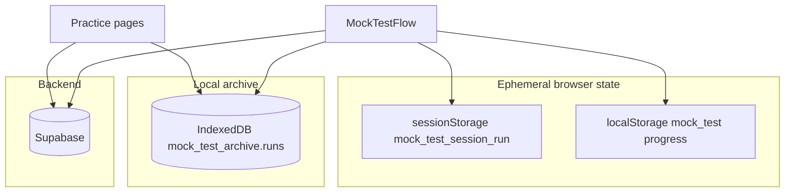
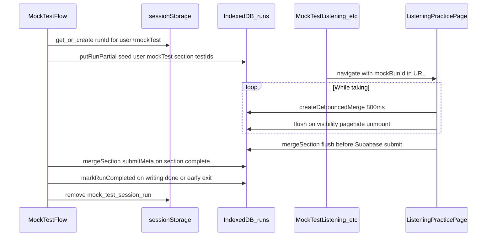
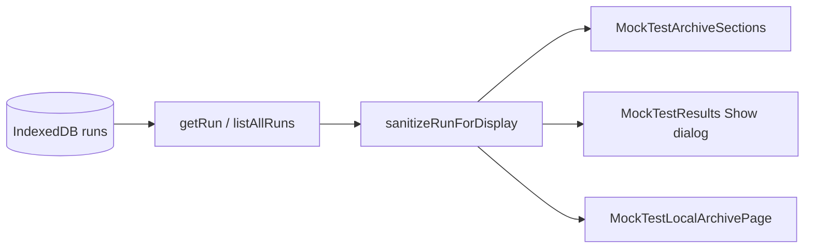

# Mock Test IndexedDB Archive Documentation

## Overview

This document describes how mock test session data is stored in the browser’s **IndexedDB** archive: why it exists, how it relates to `sessionStorage`, `localStorage`, and Supabase, the document schema, write and read paths, sanitization rules, and the UI used for staff review.

For the overall mock test flow (sections, wrappers, localStorage progress, Supabase submission), see [MOCK_TEST_FLOW_DOCUMENTATION.md](./MOCK_TEST_FLOW_DOCUMENTATION.md).

---

## 1. Purpose and constraints

### Why IndexedDB exists

The archive is a **local, per-browser** copy of a candidate’s mock test answers, intended for **office / staff review** on shared PCs. It runs **in parallel** with normal Supabase submission (`user_attempts`, `mock_test_clients`). It does **not** replace the backend.

Design rules from `src/lib/mockTestIndexedArchive.js`:

- All IndexedDB operations are wrapped in `try/catch`; failures are logged and must **not** break submit or navigation.
- Official scoring material is **never** persisted locally (see sanitization below).

### What is stored

| Data | Description |
|------|-------------|
| **User** | `id`, `email`, `username` (display name) |
| **Mock test** | `id`, `title` |
| **Per section** (`listening`, `reading`, `writing`) | `testId`, `title`, `answers`, `questionsIndex` (question text snapshot at save time), optional `submitMeta` |
| **Run metadata** | `runId`, `createdAt`, `updatedAt`, `status` (`in_progress` \| `completed`) |

`submitMeta` is limited to non-scoring fields: `attemptId`, `success`, `error` (after `sanitizeSubmitMetaForArchive`).

### What is never stored

Forbidden keys include (non-exhaustive): `correct_answer`, `correctAnswer`, `is_correct`, `explanation`, `sample_answer`, `answer_key`, `solution`, `marking_scheme`, `official_answer`, and keys starting with `correct_`. See `FORBIDDEN_ANSWER_KEYS` in `src/lib/mockTestIndexedArchive.js`.

Scores and correct counts are **not** written to the archive.

---

## 2. Storage layers

Mock test data uses four layers. Only IndexedDB is the long-term local archive.

| Layer | Key / identifier | Role in archive flow |
|-------|------------------|----------------------|
| **sessionStorage** | `mock_test_session_run` | Binds `{ mockTestId, userId, runId }` so refreshes and navigations to practice routes reuse the same `mockRunId`. Cleared when the test finishes (normal or early exit). |
| **localStorage** | `mock_test_{mockTestId}_*` | Flow progress (`currentSection`, `sectionResults`), section completion flags, in-section answers during practice. **Not** the staff archive. Cleared after writing completes. |
| **IndexedDB** | DB `mock_test_archive`, object store `runs`, key `runId` | Durable per-browser archive of full session runs until staff clears it. |
| **Supabase** | `user_attempts`, `mock_test_clients` | Authoritative backend; archive mirrors user answers only for local review. |



---

## 3. IndexedDB schema

### Database

| Property | Value |
|----------|--------|
| Database name | `mock_test_archive` |
| Version | `1` |
| Object store | `runs` |
| Key path | `runId` (string, UUID) |

On open, the client may call `navigator.storage.persist()` (best-effort) to reduce eviction on shared devices.

### Run document shape

Default shape when a run is first created (`defaultRunShape` in `src/lib/mockTestIndexedArchive.js`):

```text
{
  runId: string,
  createdAt: number,        // Date.now()
  updatedAt: number,
  status: 'in_progress' | 'completed',
  user: { id, email, username },
  mockTest: { id, title },
  sections: {
    listening: {
      testId, title, type: 'listening',
      answers: Record<question_id, { question_number, user_answer }>,
      questionsIndex: Array<QuestionIndexRow>,
      submitMeta: null | { attemptId?, success?, error? }
    },
    reading:   { ... same shape, type: 'reading' },
    writing:   { ... same shape, type: 'writing' }
  }
}
```

### `questionsIndex` row fields

Built at write time from the loaded test entity (snapshot of question text, not live DB).

**Listening / reading** (`buildQuestionsIndexFromTest`):

| Field | Source |
|-------|--------|
| `questionId` | Question UUID (`q.id`) |
| `questionNumber` | `q.question_number` |
| `groupQuestionId` | `q.question_id` (group-level id) |
| `questionText` | Question text + optional group instruction (gap-fill, table, matching, etc.) |
| `partNumber` | Part number or part id |
| `groupType` | Question group type string |
| `groupId` | Question group id |

**Writing** (`buildWritingQuestionsIndex`):

| Field | Source |
|-------|--------|
| `questionId` | Same as `taskName` (archive answer key) |
| `questionNumber` | `1` or `2` (task order) |
| `questionText` | Task name + title/instruction |
| `groupType` | `'writing_task'` |
| `taskName` | Task key used in practice state (e.g. `Task 1`, `Task 2`) |
| `userAnswerPreview` | First 500 chars of answer at index build time (debug only) |

Rows are passed through `sanitizeQuestionsIndexRow` before storage.

### `answers` shape (per section)

Each section stores **one entry per question** from `questionsIndex` (unanswered questions are included with `user_answer: null`):

```javascript
answers: {
  [question_id]: {
    question_number: number | null,  // from questionsIndex row
    user_answer: string | null       // null if not answered
  }
}
```

| Section | `question_id` key |
|---------|-------------------|
| Listening / reading | `row.questionId` ?? `row.groupQuestionId` ?? `String(row.questionNumber)` |
| Writing | `row.taskName` (e.g. `Task 1`); `question_number` is 1 or 2 |

Practice pages still pass **flat** answer maps from component state; `mergeSection` converts via `formatAnswersForArchive` when `questionsIndex` is present.

**Legacy rows:** Older archives may use flat `{ [key]: string }` values. `sanitizeRunForDisplay` upgrades them for the UI when `questionsIndex` is available.

---

## 4. Run ID lifecycle (`mockRunId`)

`mockRunId` is the IndexedDB primary key for one mock session on this browser.

### Creation and reuse

In `MockTestFlow.jsx`:

1. Constant: `MOCK_TEST_SESSION_RUN_KEY = 'mock_test_session_run'`.
2. On mount (when `effectiveMockTestId`, `userProfile.id`, and `mockTest.id` are known):
   - Read `sessionStorage`; if JSON matches current `mockTestId` + `userId`, reuse `runId`.
   - Otherwise generate `uuidv4()`, store `{ mockTestId, userId, runId }`, set React state `mockRunId`.

```javascript
// MockTestFlow.jsx — session binding
const MOCK_TEST_SESSION_RUN_KEY = 'mock_test_session_run';
// sessionStorage value: { mockTestId, userId, runId }
```

3. `putRunPartial(mockRunId, { user, mockTest, sections with listening/reading/writing testIds })` seeds the IndexedDB row.

### Passing `mockRunId` to practice pages

Section wrappers (`MockTestListening`, `MockTestReading`, `MockTestWriting`) navigate to practice routes with query params, for example:

```text
/listening-practice/{testId}?mockTest=true&mockTestId=...&mockRunId=...&mockClientId=...&duration=2400
```

Practice pages read `mockRunId` from `URLSearchParams` and only write to IndexedDB when `isMockTest` is true.

### Clearing the session key

`sessionStorage.removeItem(MOCK_TEST_SESSION_RUN_KEY)` runs on:

- Normal completion (`handleWritingComplete`)
- Early exit (`handleEarlyExit`)

The **IndexedDB run remains** (status may be `completed`). A new session later gets a **new** `runId`; old runs stay until cleared via the local archive page.



---

## 5. Write path (detailed)

### A. Session bootstrap — `MockTestFlow.jsx`

| Step | Function | Data |
|------|----------|------|
| 1 | (sessionStorage) | Resolve or create `mockRunId` |
| 2 | `putRunPartial` | `user`, `mockTest`, section `testId`s from `mockTest.listening_id` / `reading_id` / `writing_id` |

### B. Practice-page streaming writes

These files perform the bulk of answer persistence (same pattern for all three sections):

| File | Section |
|------|---------|
| `src/pages/dashboard/listening/ListeningPracticePage.jsx` | `listening` |
| `src/pages/dashboard/reading/ReadingPracticePage.jsx` | `reading` |
| `src/pages/dashboard/writing/WritingPracticePage.jsx` | `writing` |

**Debounced writes (while taking)**

- `createDebouncedMerge(800)` → `{ schedule, flush }`.
- When `isMockTest && mockRunId && currentTest/currentWriting && status === 'taking'` and the user has interacted (or has answers for writing practice mode):

```javascript
scheduleArchiveListening(mockRunId, 'listening', {
  testId: effectiveTestId,
  title: currentTest.title || null,
  answers: { ...answers },
  questionsIndex: buildQuestionsIndexFromTest(currentTest, 'listening'),
});
```

- Debounce key: `` `${runId}:${section}` `` — latest payload wins per section.

**Flush on tab hide / unload / unmount**

- `visibilitychange` → `hidden`, `pagehide`, and cleanup on unmount:
  1. `flush()` pending debounced writes
  2. Immediate `mergeSection` with `answersArchiveRef.current` (always latest answers, avoids stale closure)

**Flush before Supabase submit**

- On submit: `await flushArchive*()` then `await mergeSection(...)` with full answers + `questionsIndex`, then `submitTestAttempt` / writing submit.

Answers object keys vary by question type (UUID vs question number); reading section additionally normalizes keys on merge (see §6).

### C. URL wiring — section wrappers

`MockTestListening.jsx` (and Reading/Writing):

- After the instructional video, `navigate` to the practice path with `mockRunId` in the query string.
- `urlReady` gates rendering the practice page until the URL contains the expected `mockRunId`.

### D. Section completion — `MockTestFlow.jsx`

| Event | IndexedDB action |
|-------|------------------|
| `handleListeningComplete(result)` | `mergeSection(mockRunId, 'listening', { submitMeta: result })` |
| `handleReadingComplete(result)` | `mergeSection(mockRunId, 'reading', { submitMeta: result })` |
| `handleWritingComplete(result)` | `markRunCompleted(mockRunId)`; `mergeSection(..., 'writing', { submitMeta: result })`; clear sessionStorage |
| `handleEarlyExit(result, section)` | `markRunCompleted`; optional `submitMeta` for current section only; clear sessionStorage |

Answers for completed sections are already in IndexedDB from the practice page; completion handlers mainly attach **submit metadata** and finalize run status.

---

## 6. Sanitization and reading answer normalization

All writes pass through sanitizers inside `mergeSection` / `mergeSectionsDeep` / `putRunPartial`.

| Export | Purpose |
|--------|---------|
| `sanitizeAnswersForArchive` | Recursively remove forbidden keys from answer blobs |
| `sanitizeQuestionsIndexRow` | Strip scoring/solution fields from index rows |
| `sanitizeSubmitMetaForArchive` | Keep only `attemptId`, `success`, `error` |
| `formatAnswersForArchive` | Build structured `{ [question_id]: { question_number, user_answer } }` from flat practice answers + `questionsIndex` |
| `normalizeReadingAnswersForArchive` | Alias for `formatAnswersForArchive(..., 'reading')` |
| `pickFlatUserAnswer` | Resolve a string from flat or structured archive maps (used when building + legacy display) |
| `resolveArchiveQuestionId` | Choose `question_id` key per section/row |
| `sanitizeRunForDisplay` | Full run sanitizer for UI; upgrades legacy flat answers when `questionsIndex` exists |

When `mergeSection` receives a non-empty `questionsIndex`, all sections use `formatAnswersForArchive` (listening, reading, writing).

### Display lookup — `MockTestArchiveSections.jsx`

`lookupUserAnswer(answers, row)`:

1. `answers[row.questionId]?.user_answer` or `answers[row.taskName]?.user_answer`
2. Legacy fallback: `pickFlatUserAnswer` for old flat key-value rows

UI shows **Question {number}**, question text, and **Your answer: {text or "No answer"}**.

---

## 7. Read and display path



### `MockTestResults.jsx`

- Route: embedded in mock flow as `currentSection === 'results'`.
- Resolves `effectiveMockRunId` from: prop `mockRunId` → `location.state.mockRunId` → `?mockRunId=` query.
- **“Show archived answers”** → `getRun(effectiveMockRunId)` → `sanitizeRunForDisplay` → dialog with `MockTestArchiveSections`.
- On mount, clears **localStorage** for this mock test only (`clearAllMockTestDataForId`); IndexedDB is untouched.

### `MockTestLocalArchivePage.jsx`

- Route: `/mock-tests/local-archive` (linked from `MockTestsPage`).
- `listAllRuns()` → sort by `updatedAt` descending → sanitize each run.
- **“Clear local archive”** → `clearAllArchiveRuns()` (wipes entire `runs` store).
- Reloads on `window` `focus` (picks up runs from other tabs).

### `MockTestArchiveSections.jsx`

Shared viewer component:

- User block, mock test title/id, run id, status.
- Per section: scrollable list of `questionsIndex` rows with “Your answer” via `lookupUserAnswer`.
- Optional `submitMeta` JSON per section.

---

## 8. API reference (`mockTestIndexedArchive.js`)

| Function | Purpose |
|----------|---------|
| `openDb` (internal) | Open `mock_test_archive` v1; create `runs` store if needed; optional storage persistence |
| `putRunPartial(runId, patch)` | Read-merge-write full run document; deep-merge `sections` |
| `mergeSection(runId, section, data)` | Merge one section: answers, `questionsIndex`, `testId`, `title`, `submitMeta` |
| `getRun(runId)` | Single run or `null` |
| `listAllRuns()` | All runs, newest `updatedAt` first |
| `clearAllArchiveRuns()` | `store.clear()` |
| `markRunCompleted(runId)` | `putRunPartial` with `status: 'completed'` |
| `createDebouncedMerge(delayMs?)` | `{ schedule, flush }` for batched section writes (default 800 ms) |
| `buildQuestionsIndexFromTest(currentTest, testType)` | Listening/reading question snapshots |
| `buildWritingQuestionsIndex(currentWriting, answers)` | Writing task snapshots (`questionId` = task name, `questionNumber` = 1/2) |
| `formatAnswersForArchive` / `pickFlatUserAnswer` / `resolveArchiveQuestionId` | Structured answer builders |
| `sanitizeRunForDisplay(run)` | Safe read path for UI; upgrades legacy flat answers |
| `sanitizeAnswersForArchive` / `sanitizeQuestionsIndexRow` / `sanitizeSubmitMetaForArchive` / `normalizeReadingAnswersForArchive` | Sanitization and reading alias |

---

## 9. Failure modes and operations

| Situation | Behavior |
|-----------|----------|
| IndexedDB unavailable | `openDb` rejects; functions log and return; Supabase submit continues |
| `putRunPartial` / `mergeSection` error | Logged; no user-facing block on submit |
| Results page without `mockRunId` | Button may still show; dialog error: “No session archive id” |
| User completes test | sessionStorage cleared; IDB run kept with `status: 'completed'` |
| Shared PC | localStorage cleared per mock test after writing; **all** IDB runs remain until staff uses “Clear local archive” |
| Staff review after candidate leaves | Open `/mock-tests/local-archive` or “Show archived answers” on results (same browser) |

---

## 10. Related files map

| File | Role |
|------|------|
| `src/lib/mockTestIndexedArchive.js` | IndexedDB layer, sanitization, index builders, debounced merge |
| `src/pages/dashboard/mock/MockTestFlow.jsx` | `mockRunId` lifecycle, seed row, section `submitMeta`, `markRunCompleted` |
| `src/pages/dashboard/mock/MockTestListening.jsx` | Pass `mockRunId` into listening practice URL |
| `src/pages/dashboard/mock/MockTestReading.jsx` | Pass `mockRunId` into reading practice URL |
| `src/pages/dashboard/mock/MockTestWriting.jsx` | Pass `mockRunId` into writing practice URL |
| `src/pages/dashboard/listening/ListeningPracticePage.jsx` | Debounced + flush IDB writes; pre-submit flush |
| `src/pages/dashboard/reading/ReadingPracticePage.jsx` | Same for reading |
| `src/pages/dashboard/writing/WritingPracticePage.jsx` | Same for writing |
| `src/components/mock/MockTestArchiveSections.jsx` | Shared Q/A display component |
| `src/pages/dashboard/mock/MockTestResults.jsx` | Per-session archive dialog |
| `src/pages/dashboard/mock/MockTestLocalArchivePage.jsx` | All sessions on device |

---

## Related documentation

- [MOCK_TEST_FLOW_DOCUMENTATION.md](./MOCK_TEST_FLOW_DOCUMENTATION.md) — Full mock test flow, localStorage, Supabase, wrappers, and completion signals (no IndexedDB detail).
- [MOCK_TEST_WRITING_DOCUMENTATION.md](./MOCK_TEST_WRITING_DOCUMENTATION.md) — Writing-specific mock behavior.
