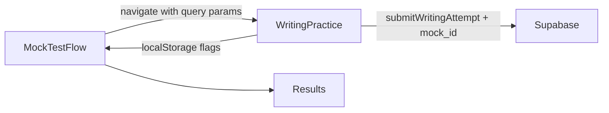
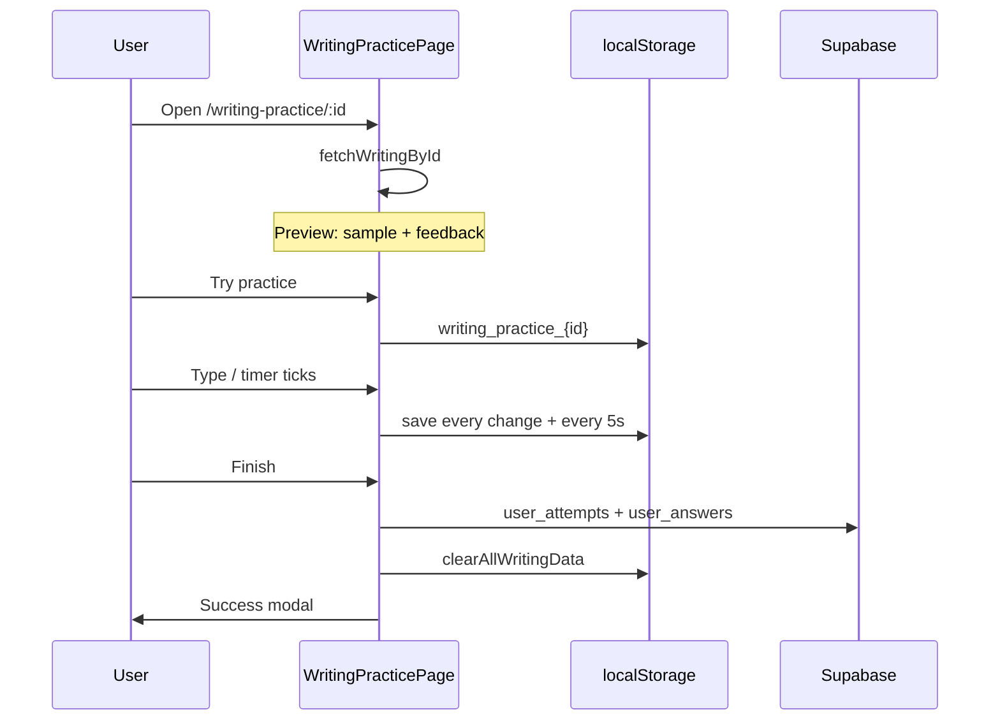

# Current Writing Feature — Technical Overview

This document describes how the **Writing** module works today in the web app. Use it as a baseline when designing the new writing experience.

---

## 1. High-level summary

Writing is an IELTS-style practice module with:

- A **library** of curated tests from Supabase (`writings` + `writing_tasks`)
- A **practice session** with split-pane UI (prompt left, answer right), timer, Task 1 / Task 2 switching, and submission to `user_attempts` / `user_answers`
- **Own Writing** — free-form practice without a library test (`/own-writing`)
- **History** — past attempts with filters (`/writing/writing-history`)
- **Mock test** integration — same practice page with stricter rules (fullscreen, no samples/feedback, auto-timer, forced submit on exit)

Regular practice and mock tests share `WritingPracticePage` but differ in URL params, storage keys, and UX rules.

---

## 2. Routing and access control

Defined in `src/App.jsx`.

| Route | Layout | Purpose |
|-------|--------|---------|
| `/writing` | `DashboardLayout` (regular) | Writing library |
| `/writing-practice/:id` | Regular or `MockTestLayout` | Timed / untimed practice for one writing |
| `/own-writing` | Regular | User-defined prompts (no DB test) |
| `/writing/writing-history` | Regular | List of completed attempts |

**Practice route duplication:** `/writing-practice/:id` is registered under both `MockTestRoute` + `MockTestLayout` and `RegularDashboardRoute` + `DashboardLayout`. Which layout applies depends on `sessionStorage.accessMode` (`regular` vs `mockTest`) and redirect logic in `App.jsx`.

**Access mode:** Visiting `/writing` sets `accessMode` to `regular`. Mock flows set `mockTest`. Users in mock mode are redirected away from `/writing` (and related dashboard routes) to `/mock-tests`.

**Practice pages** (including writing) preserve `accessMode` on navigation so mock and regular contexts do not mix.

### URL query parameters (`WritingPracticePage`)

| Param | Values | Effect |
|-------|--------|--------|
| `mode` | `practice` | Start timed practice immediately |
| `mode` | `review` | Load latest (or specific) attempt from DB; read-only answers |
| `attemptId` | UUID | With `mode=review`, load that attempt |
| `mockTest` | `true` | Mock test mode |
| `mockTestId` | UUID | Mock test id → stored on attempt as `mock_id` |
| `mockClientId` | UUID | Updates mock client status on completion |
| `mockRunId` | string | IndexedDB archive for offline resilience |
| `duration` | seconds | Overrides writing duration in mock mode |

Entry from library cards: `/writing-practice/{writingId}` (`CardOpen.jsx`).

History review: `/writing-practice/{id}?mode=review&attemptId={attemptId}` (`ComplatedCard.jsx`).

---

## 3. Data model (Supabase)

### `writings`

Fetched by `useWritingStore` (`src/store/testStore/writingStore.js`).

**List query (`fetchWritings`):**

- `is_active = true`
- `is_mock = false` OR `is_mock IS NULL` (mock-only writings excluded from library)
- Join: `writing_tasks(task_name)` for **task label** derivation
- Ordered by `created_at` desc

**Fields used in UI (from code comments and usage):**

| Field | Usage |
|-------|--------|
| `id` | Route param, FK for tasks and attempts |
| `title` | Library card, header |
| `difficulty` | Filtering in `TestsLibraryPage` (EASY / MEDIUM / HARD) |
| `duration` | Timer length (converted to seconds via `convertDurationToSeconds`) |
| `is_active`, `is_premium` | Library / gating |
| `is_mock` | Excluded from regular library |
| `created_at`, `updated_at` | Sorting |

**Derived on client:** `taskLabel` — `"Task 1"`, `"Task 2"`, or `"Both"` from linked `writing_tasks.task_name`.

**Enriched on client:** `task_types` — `Set` of task type strings from `writingTaskTypeStore`.

### `writing_tasks`

Child rows per writing. One writing may have Task 1 only, Task 2 only, or both.

| Field | Usage |
|-------|--------|
| `id` | `user_answers.question_id` |
| `writing_id` | Parent |
| `task_name` | `"Task 1"` or `"Task 2"` — keys for `answers` state |
| `title` | Shown in practice header |
| `task_type` | Filter facet (see §9) |
| `content` | HTML prompt (parsed with `html-react-parser`) |
| `image_url` | Task 1 visuals (chart, map, etc.) |
| `sample` | Shown in **preview** mode (before practice) |
| `feedback` | Shown in preview when not in practice/mock |

Tasks are **sorted client-side** so Task 1 always precedes Task 2.

### `user_attempts` (writing)

Via `useWritingCompletedStore` (`writingCompletedStore.js`):

- `type: 'writing'`
- `writing_id`, `user_id`
- `time_taken` (seconds, min 1)
- `score`, `correct_answers`: **null** (no auto scoring)
- `mock_id`: set when submitted from mock test flow
- Regular history: `mock_id IS NULL`

### `user_answers`

One row per non-empty task answer:

- `attempt_id`, `question_id` (= `writing_tasks.id`)
- `user_answer` (text)
- `question_type: 'writing'`
- `question_number` (1 or 2 from task order)
- `is_correct: false`, `correct_answer: ''`

---

## 4. State management

### 4.1 `useWritingStore` — `src/store/testStore/writingStore.js`

Zustand store for **content catalog** and **active test load**.

| State | Description |
|-------|-------------|
| `writings` | Library list (enriched with `taskLabel`, `task_types`) |
| `currentWriting` | Full writing + nested `writing_tasks[]` for practice |
| `loadingWritings`, `loadingCurrentWriting` | Loading flags |
| `errorWritings`, `errorCurrentWriting` | Errors |

| Action | Description |
|--------|-------------|
| `fetchWritings()` | Library |
| `fetchWritingById(id)` | Single test + all tasks |
| `clearCurrentWriting()` | Reset active test |
| `setWritingList(list)` | Manual list override |

### 4.2 `useWritingTaskTypeStore` — `src/store/testStore/writingTaskTypeStore.js`

Caches `writing_id → Set(task_type)` from `writing_tasks.task_type`.

- `fetchTaskTypesForWritings(writingIds)` — batched, 10s timeout, skips cached IDs
- Used by library filters and history enrichment
- On RLS/permission errors, logs and may return empty sets

### 4.3 `useWritingCompletedStore` — `src/store/testStore/writingCompletedStore.js`

Persistence of user work (not in the user’s file list but central to practice).

| Action | Description |
|--------|-------------|
| `submitWritingAttempt(writingId, answers, timeTaken, mockTestId?)` | Insert attempt + answers; rollback attempt if answers fail |
| `getWritingAttempts()` | History list (non-mock, has `writing_id`) |
| `getLatestWritingAttempt(writingId, attemptId?)` | Review mode data → `{ answers: { "Task 1": "...", ... } }` |

Auth user id is read from `localStorage` key `auth-storage` (Zustand persist), not only from `useAuthStore`.

---

## 5. Local storage

### 5.1 Regular practice — `src/store/LocalStorage/writingStore.js`

| Key pattern | Purpose |
|-------------|---------|
| `writing_practice_{testId}` | In-progress session |
| `writing_result_{testId}` | Legacy/post-submit snapshot (mostly cleared on re-entry) |

**Practice payload:** `answers`, `timeRemaining`, `elapsedTime`, `startTime`, `isPracticeMode`, `isStarted`, `isPaused`, `bookmarks`, `lastSaved`.

**Helpers:** `save/load/clear` practice and result; `clearAllWritingPracticeData`, `clearAllWritingData`.

**Note:** File header comment still says “Reading Practice” — copy-paste artifact.

### 5.2 Mock test section storage

When `mockTest=true`, practice uses `saveSectionData(mockTestId, 'writing', ...)` from `mockTestStorage.js`, not `writing_practice_*`.

Regular mode explicitly calls `clearAllMockTestData()` so mock keys do not leak into normal writing.

### 5.3 Mock completion flags

After successful submit in mock mode:

- `mock_test_{mockTestId}_writing_completed` = `'true'`
- `mock_test_{mockTestId}_writing_result` = JSON `{ success, attemptId }`

`MockTestFlow` reads these to advance sections.

### 5.4 IndexedDB archive (mock only)

`mergeSection` / `buildWritingQuestionsIndex` + debounced merge (`mockTestIndexedArchive`) persist answers during mock writing for crash/refresh recovery (`mockRunId`).

---

## 6. Pages and user flows

### 6.1 Writing library — `WritingPage.jsx`

Thin wrapper around `TestsLibraryPage`:

- Title: “Writing Library”
- `testType="writing"`
- `fetchTests={fetchWritings}`
- Header CTA: **Practice Now** → `/own-writing`

Filtering, grid/list, difficulty tabs, and task-type filters live in `TestsLibraryPage` (see §9).

### 6.2 Writing practice — `WritingPracticePage.jsx`

Large component (~2000 lines) wrapped in `AppearanceProvider` + `AnnotationProvider`.

#### Modes (state machine)

| `status` | `isPracticeMode` | Left pane | Right pane |
|----------|-------------------|-----------|------------|
| `taking` | false | Prompt + optional **feedback** | **Sample** answer |
| `taking` | true | Prompt (no feedback in practice) | **Textarea** |
| `reviewing` | false | Prompt | User’s saved answer (read-only) |

Mock test: always practice-like (textarea), no sample/feedback, timer auto-starts.

#### Starting practice

1. User clicks **Try practice** in `QuestionHeader` → `handleTryPractice`
2. Or URL `?mode=practice`
3. Or focuses textarea (triggers `handleTryPractice`)
4. Clears other tests’ `writing_practice_*` keys via `clearAllWritingPracticeData()`

#### Timer

- Duration from `currentWriting.duration` (or `duration` query param in mock)
- Countdown when `isPracticeMode && isStarted && !isPaused`
- At 0: `handleAutoSubmit` (toast, no finish modal)
- Pause toggled from header

#### Task switching

Footer tabs when `writing_tasks.length > 1`. `answers` is keyed by `task_name` (`"Task 1"`, `"Task 2"`).

Default active task: **Task 1** if present.

#### Finish flow

1. `handleFinish` — requires ≥1 word per task (word count helper treats hyphenated tokens)
2. `WritingFinishModal` → `handleSubmitFinish`
3. `submitWritingAttempt` → on success (regular): clear all writing local data, show `WritingSuccessModal` (PDF download, link to history)
4. Mock: navigate to `/mock-test/flow/{mockTestId}`

#### Review flow

- URL `?mode=review` (+ optional `attemptId`)
- `getLatestWritingAttempt` loads answers into state
- **Retake** clears URL mode, resets answers/timer, clears `writing_practice_{id}`

#### Other features

- **Resizable** split pane (20–80%)
- **Annotations** (highlight/note) on left pane via `TextSelectionTooltip` + `NoteSidebar`
- **PDF export** — `generateWritingPDF` with tasks, images, elapsed time
- **Word count** — footer shows count; minimum hint 150 (Task 1) / 250 (Task 2) — **not enforced** on submit (only “at least one word” per task)
- **Appearance** — theme, font size from `AppearanceContext`
- **Footer chrome** — clock, battery tooltip, network icons, brand, Finish / Retake buttons

#### Mock-only security

- `useMockTestSecurity` + fullscreen (`autoEnterFullscreen`, `monitorFullscreen`)
- `MockTestExitModal` on back or fullscreen exit → `mockTestForceSubmit` event
- Early exit sets `mockTestForceSubmit` with section `writing`

### 6.3 Own writing — `OwnWritingPage.jsx`

Separate flow: user types **custom questions** and answers for Task 1 / Task 2 locally (React state only — **no Supabase submit** in the portion reviewed). Timer, resize, PDF, finish/success modals mirror practice UX. Not wired to `useWritingStore`.

### 6.4 Writing history — `WritingHistoryPage.jsx`

- Loads `getWritingAttempts()`
- Enriches with `task_types` per writing
- Filters: search, difficulty tab, task type checkboxes, sort oldest/newest
- Cards (`ComplatedCard`) → review or practice links

---

## 7. UI component map

| Component | Role |
|-----------|------|
| `TestsLibraryPage` | Library grid, filters, navigation to practice |
| `QuestionHeader` | Back, timer, Try practice, pause, redo in review |
| `WritingFinishModal` | Confirm submit |
| `WritingSuccessModal` | Post-submit PDF + history |
| `MockTestExitModal` | Mock exit / force submit |
| `TextSelectionTooltip` / `NoteSidebar` | Annotations |
| `CardOpen` / `ComplatedCard` | Links into practice/review |

---

## 8. Mock test integration (end-to-end)

1. `MockTestFlow` sets section `writing` and navigates to `/writing-practice/{writing_id}?mockTest=true&mockTestId=...&mockClientId=...&mockRunId=...&duration=...`
2. Practice auto-starts timer; restores from `loadSectionData(mockTestId, 'writing')` on refresh
3. Submit writes attempt with `mock_id`; sets completion localStorage keys
4. Flow returns to mock test; results pages can load writing attempt by `writing_id` / type

Library **excludes** `is_mock` writings; mock uses dedicated `writing_id` on the mock test record.

---

## 9. Library filtering (`TestsLibraryPage` + utils)

### Task label filter (writing-specific)

- **Task 1** — writings that include Task 1
- **Task 2** — writings that include Task 2  
- **Both** — writings with both tasks  

Uses derived `taskLabel` on each writing.

### Task type filter (9 types)

From `writingTaskTypeUtils.js`:

`tables`, `line_graph`, `bar_chart`, `pie_chart`, `map`, `process_diagram`, `formal_letter`, `semi_formal`, `informal`

Matched against `writing.task_types` Set from `writing_tasks.task_type`.

### Other filters

Shared with reading/listening: difficulty tabs, search, sort, grid/list view, premium flags (via shared test card logic).

---

## 10. Persistence timeline (regular practice)

Refresh during practice: restores answers and recalculates remaining time from `startTime`, `elapsedTime`, `lastSaved`.

After submit: re-opening same test shows **cleared** preview state (no auto-restore of submitted answers unless `mode=review`).

---

## 11. Scoring and feedback

- **No automated band score** — `score` stays null
- **Feedback** on tasks: HTML in `writing_tasks.feedback`; visible only in non-practice, non-mock preview
- Placeholder copy when feedback missing: “personalized feedback in the future”
- **Analytics dashboard** may show `scores.writing` from a separate aggregate (see `DashboardPage`) — not computed inside writing practice submit

---

## 12. Dependencies on shared infrastructure

| System | Writing usage |
|--------|----------------|
| `useAuthStore` | Review mode, submit auth |
| `useMockTestClientStore` | Client status `completed` on mock submit |
| `useSettingsStore` | PDF generation settings |
| `AppearanceContext` | Theme / font |
| `AnnotationContext` | Highlights and notes |
| `convertDurationToSeconds` | Timer |
| `exportOwnWritingPdf` | PDF for practice and own writing |

---

## 13. Known quirks and technical debt

1. **Dual storage systems** — regular (`writing_practice_*`) vs mock (`mock_test_*` section + IndexedDB); must stay isolated (`clearAllMockTestData` in regular mode).
2. **ID fallback** — `useParams` may fail after `history.replaceState`; page parses `/writing-practice/{id}` from `window.location.pathname`.
3. **Word minimums** — UI shows 150/250; validation only checks ≥1 word per task.
4. **localStorage writingStore header** — still references “Reading Practice”.
5. **Own Writing** — not integrated with `user_attempts` / history in the same way as library tests.
6. **Large monolith** — `WritingPracticePage.jsx` mixes UI, timer, mock security, archive, review, and submit.
7. **Commented ComingSoon** — old `WritingPage` used `ComingSoonPage`; current page is live library.
8. **`bookmarks` in save API** — saved to localStorage but not clearly used in writing UI.
9. **Mock vs regular duplicate routes** — same component, different layouts/guards; behavior driven by query params + `sessionStorage`.

---

## 14. File reference (core)

| Path | Responsibility |
|------|----------------|
| `src/App.jsx` | Routes, access mode, practice page registration |
| `src/pages/dashboard/writing/WritingPage.jsx` | Library entry |
| `src/pages/dashboard/writing/WritingPracticePage.jsx` | Main practice UI and logic |
| `src/pages/dashboard/writing/OwnWritingPage.jsx` | Free-form practice |
| `src/pages/dashboard/writing/WritingHistoryPage.jsx` | Attempt history |
| `src/store/testStore/writingStore.js` | Catalog + current writing fetch |
| `src/store/testStore/writingTaskTypeStore.js` | Task type cache for filters |
| `src/store/testStore/writingCompletedStore.js` | Submit + history + review fetch |
| `src/store/LocalStorage/writingStore.js` | Practice/result localStorage |
| `src/store/testStore/utils/writingTaskTypeUtils.js` | Filter type constants + labels |
| `src/components/TestsLibraryPage.jsx` | Library UI and filters |

---

## 15. Questions for the new writing feature

When comparing designs, consider whether the new feature should:

- Keep **one page** for preview + practice + review or split routes/components
- Unify **Own Writing** with library attempts and history
- Enforce **IELTS word limits** (150/250) at submit time
- Add **real scoring / AI feedback** (currently null score + static HTML feedback)
- Simplify **storage** (single strategy for regular + mock + offline)
- Support **Task 1-only / Task 2-only** writings explicitly in UX (already supported in data)
- Retain **annotations** and **PDF export**
- Change **preview-first** flow (sample visible before practice) vs exam-realistic (no sample until after submit)

---

*Generated from codebase analysis. Last updated: May 2026.*
