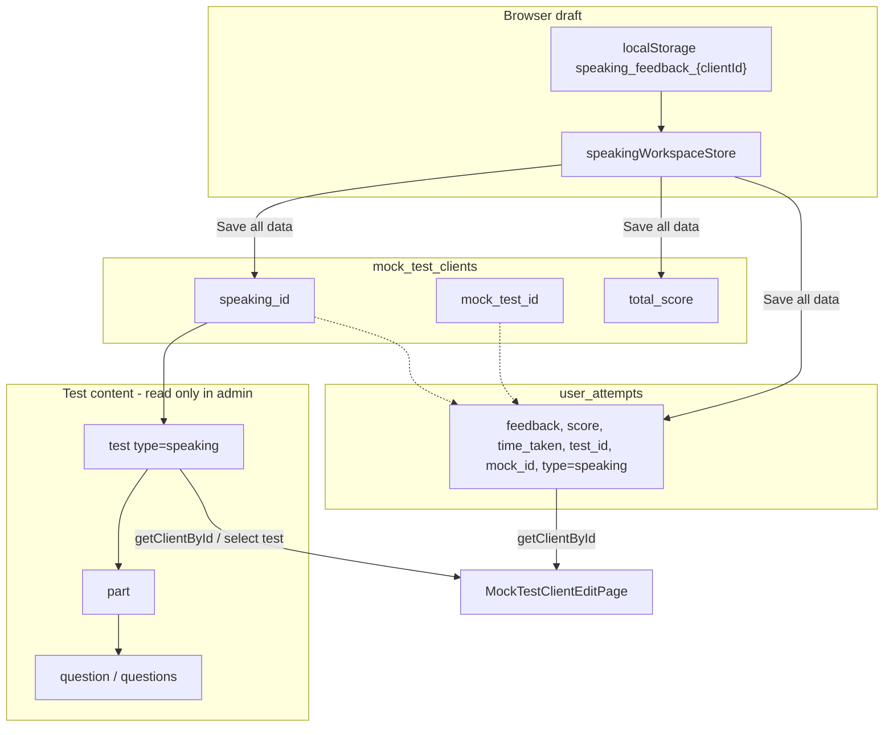

# Mock Test Speaking — Data Storage

How speaking data is stored for mock test clients in the admin app. Primary code: `src/stores/mockTestClientStore.js`, `src/pages/MockTestClientEditPage.jsx`, `src/stores/speakingWorkspaceStore.js`, `src/components/card/SpeakingUserWorkspace.jsx`.

## Overview

Speaking uses **three layers**:

1. **Supabase** — durable source of truth (which test, score, feedback, duration, link to mock).
2. **Page state** (`formData` + `client`) — what the edit UI shows.
3. **Draft cache** (`speakingWorkspaceStore` + `localStorage`) — in-progress feedback, score, and timer before **Save all data**.

Unlike reading/listening, speaking does **not** use `user_answers` in this admin flow. There is no per-question answer storage for mock speaking here—only the test structure plus one attempt row per user/test.

---

## Database tables

### 1. `mock_test_clients` — booking + which test was chosen

| Field | Role for speaking |
|--------|-------------------|
| `speaking_id` | Selected speaking test (`test.id`, `type = 'speaking'`). Can be set **before** the student finishes the full mock. |
| `user_id` | Student; required to save attempts. |
| `mock_test_id` | Link to `mock_test.id` once the full mock exists; optional early when status is `booked`. |
| `total_score` | Overall band (average of four sections), updated on save. |

Test **content** is not stored on the client row—only the **reference** (`speaking_id`).

### 2. `test` → `part` → `question` → `questions` — test content

Loaded with a nested Supabase select (same shape in `getClientById` and `handleSpeakingTestSelect`):

```sql
-- Conceptual shape (via PostgREST nested select)
test (type = 'speaking')
  └── part (part_number, title, content)
        └── question (type, instruction)
              └── questions (question_number, question_text, explanation)
```

Attached to the in-memory client as:

- `speaking_data` — full nested tree
- `speaking_test_id` — selected test id

Parts and questions are sorted by `part_number` and `question_number` after fetch.

### 3. `user_attempts` — score, feedback, duration

Primary storage for **admin grading** of speaking:

| Column | Speaking usage |
|--------|----------------|
| `user_id` | Student |
| `test_id` | Speaking test id |
| `writing_id` | Always `null` (distinguishes from writing attempts) |
| `type` | `"speaking"` |
| `feedback` | HTML string (admin feedback) |
| `score` | Band score (via `normalizeScore`) |
| `time_taken` | Seconds (from workspace timer on save) |
| `mock_id` | `mock_test.id` when linked; **can be null** if speaking was saved while status is still `booked` |

**Lookup order** when loading (`getClientById`):

1. `test_id = speaking_id` + `user_id` + `writing_id IS NULL` (works **without** `mock_id`).
2. Else latest attempt for `user_id` + `mock_id` where `type === 'speaking'`.

For **`booked`** clients, the store only loads speaking (not L/R/W), so admins can pick a test and grade before the full mock is submitted.

---

## Client-side storage (draft)

`speakingWorkspaceStore` keeps feedback, score, and timer in memory and mirrors feedback/score to:

| Item | Detail |
|------|--------|
| **Key** | `speaking_feedback_{mock_test_clients.id}` |
| **Value** | `{ feedback, score }` (JSON) |

`timeTaken` stays in Zustand until save; it is **not** written to `localStorage`.

On successful **Save all data**, `clearSpeakingData(id)` removes the localStorage key and resets workspace state.

---

## Edit page flows

### Load (`MockTestClientEditPage`)

1. `getClientById(id)` → Supabase client + speaking attempt + nested `test` tree.
2. `formData` receives `speaking_score`, `speaking_feedback`.
3. `SpeakingUserWorkspace` receives `speaking_data`, `speaking_test_id`, `speaking_time_taken`; initializes workspace store (localStorage can override empty server values).

### Select a speaking test (`handleSpeakingTestSelect`)

1. Load full test from `test` (nested `part` / `question` / `questions`).
2. `UPDATE mock_test_clients SET speaking_id = testId`.
3. If a `user_attempts` row already exists for `test_id` + `user_id`, only bump `updated_at` (does not create a row here).
4. Update local `client.speaking_data`, `speaking_test_id`, `speaking_id`.

### Save all data (`handleSaveFeedbackAndScores` → `saveFeedbackAndScores`)

Payload includes:

- `speaking_feedback` — prefers non-empty form vs workspace store (store can lag behind typing).
- `speaking_score` — workspace store if set, else form.
- `speaking_time_taken` — from workspace store.
- `speaking_test_id` — from `client.speaking_test_id` or `client.speaking_id`.
- `total_score` — calculated average of four sections.

Store behavior:

- **Update** existing `user_attempts` row if found.
- **Insert** new row if none exists but `speaking_test_id` and feedback/score/time are provided.
- **Update** `mock_test_clients`: `total_score`, and `speaking_id` when `speaking_test_id` is sent.

`mock_id` on the speaking attempt is set only when the client has `mock_test_id` and reading/listening or writing attempts already exist for that mock—speaking can stay unlinked until the rest of the mock exists.

### `finishSpeakingAttempt`

Defined in `mockTestClientStore.js` (dedicated insert/update for speaking). **Not called from the UI today**; the edit page uses **`saveFeedbackAndScores`** only.

---

## Data flow diagram



---

## Comparison with other mock sections

| Aspect | Speaking | Reading / Listening | Writing |
|--------|----------|---------------------|---------|
| Test reference | `mock_test_clients.speaking_id` + `user_attempts.test_id` | `user_attempts.test_id` | `user_attempts.writing_id` |
| User responses | Not stored in `user_answers` (admin mock flow) | `user_answers` per question | `user_answers` (2 tasks) |
| Grading storage | `user_attempts.feedback` + `score` | Same + auto score from answers | Same |
| Early (`booked`) | Yes — test + grade without `mock_id` | Typically after mock started | After mock has writing |

---

## Practical implications

1. **Choosing a test** only persists `speaking_id` on `mock_test_clients` until you save feedback/score (unless a `user_attempts` row already exists).
2. **Grading** persists in **`user_attempts`**, not on `mock_test_clients` (except `total_score` and `speaking_id`).
3. **Unsaved edits** may live in `localStorage` under the **mock client id** (`/mock-test-client/edit/:id`), not the user id.
4. **`mock_id`** on the speaking attempt is optional early on; it is backfilled when the full mock is linked and other sections exist.

---

## RLS note

Admin writes to `user_attempts` use the student’s `user_id`. If inserts/updates fail with `42501`, policies must allow admins to insert/update rows where `auth.uid()` ≠ `user_id`. See store comment referencing `docs/rls-admin-user-attempts.sql` (if present in your deployment).

---

## Related files

| File | Responsibility |
|------|----------------|
| `src/stores/mockTestClientStore.js` | `getClientById`, `saveFeedbackAndScores`, `finishSpeakingAttempt` |
| `src/pages/MockTestClientEditPage.jsx` | UI, test selection, save orchestration |
| `src/stores/speakingWorkspaceStore.js` | Draft feedback/score, timer, localStorage |
| `src/components/card/SpeakingUserWorkspace.jsx` | Speaking UI, sync store ↔ form |
| `src/stores/speakingStore.js` | CRUD for speaking **test content** (not mock client attempts) |
